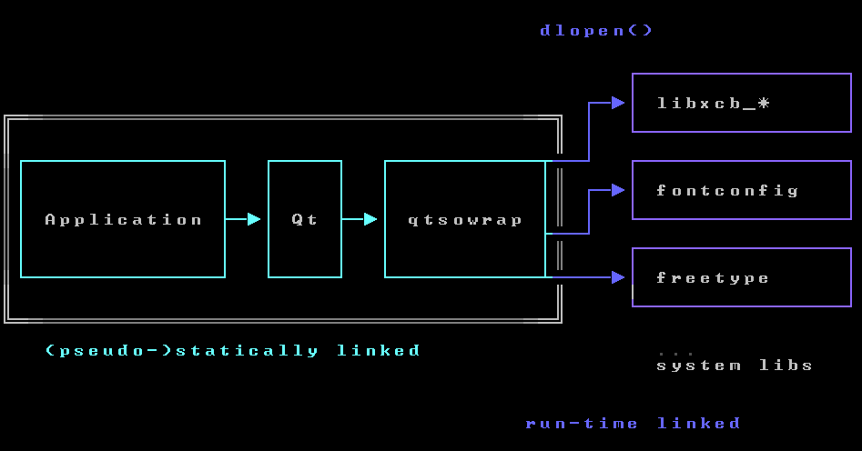

# qtsowrap



This is a library that wraps Qt's Linux system integration dependencies in a way so that they are loaded at run time, and thus unneeded during the compile process. The aim is to wrap Qt's entire interface with the operating system.

The source is entirely auto-generated from upstream headers. [scripts/gen.py](scripts/gen.py) contains the definitions of the libraries and functions to wrap. See the section "Generation" below on how to regenerate the source code after updating these, or just to check.

For now it handles the boilerplate for:

- xcb and sublibraries
- xkb
- fontconfig
- freetype

## why

- Reduce the number of libraries in 'depends' (faster builds). The display and font system libraries no longer need to be built, this library acts as a full replacement from the perspective of the build system.
- Optional dependencies (eg Wayland, X11) in otherwise static Qt build. Unlike when directly linking, failing to load libraries is not necessarily fatal and can instead disable the functionality.
  - Qt's `xcb_xinput` could be handled in this way. It's a library that's only present for newer xcb versions, and is used to support XInput2, which is optional (that said, it's likely not needed for us at all). Currently Qt hacks around this by building an internal version of this lib.
- Could print more useful errors when a library is missing.
- Tighter control over version requirements by restricting which symbols are wrapped.
- Optional feature support by being tolerant of (some) missing symbols.
- Could potentially do some checks before loading the library (and its dependencies), or log hashes for troubleshooting.

Not all of these are currently implemented.

## Building

A CMake build system is used to build the stub library.

```sh
mkdir build
cd build
cmake .. -DCMAKE_INSTALL_PREFIX=/.../my/staging/dir
make
make install
```

## Usage

Include the wrapper header instead of the actual header (it will internally include that). The library functions can be called as normally. Just make sure to initialize every library before using it, and check for errors:
```
#include "xcb-sowrap.h"

int main()
{
    if (initialize_xcb()) {
        fprintf(stderr, "Unable to load the xcb library. Make sure to install it from your distribution's package repository.\n");
        return 1;
    }
    /* Use xcb functions here. */
    xcb_connect(...);
    return 0;
}
```

Once a library is bound, it's bound for the lifetime of the process. There is no need to call a `deinitialize`. Calling `initialize` multiple times does not make a difference, the dynamic linker will notice that it already loaded the library and re-use it.

## Patching Qt

Qt cannot use this library by default, it needs to be patched.

## Generation

To re-generate the headers and implementation files in `src_gen` and `include_gen` from the headers in `include`:

```python
python3 scripts/gen.py
```

This process should be fully deterministic, so to verify that this worked correctly is a matter of re-running the script.

### Versions

The following header versions are, as currently, in `include/` (same as depends on bitcoin commit `c05c214f2e9cfd6070a3c7680bfa09358fd9d97a`):

- fontconfig 2.12.6
- freetype 2.11.0
- libxcb 1.14
- libxcb_util_image 0.4.0
- libxcb_util_keysyms 0.4.0
- libxcb_util 0.4.0
- libxcb_util_render 0.3.9
- libxcb_util_wm 0.4.1
- xcb_proto 1.15.2
- xkbcommon 0.8.4

## Credits

- This is based on [dynload-wrapper](https://github.com/hpvb/dynload-wrapper) by Hein-Pieter van Braam <hp@tmm.cx> et al, which is also used by the Godot game engine. This project made the following changes:

  - Parse multiple includes consecutively instead of one at a time: this allows for implicit dependencies between headers, e.g. headers that assume some other header to already have been included by the referencing code.
  - Handle exported variables. This is necessary for xcb's `xcb_randr_id` and such.
